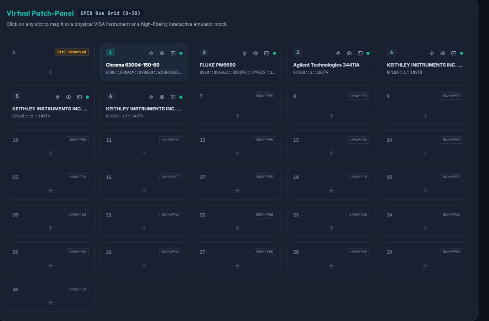
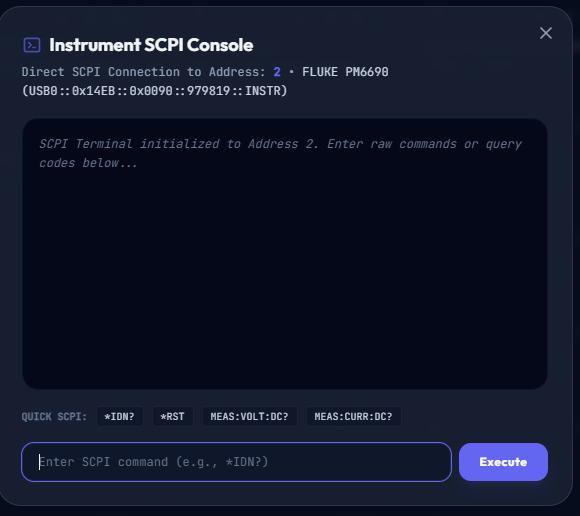
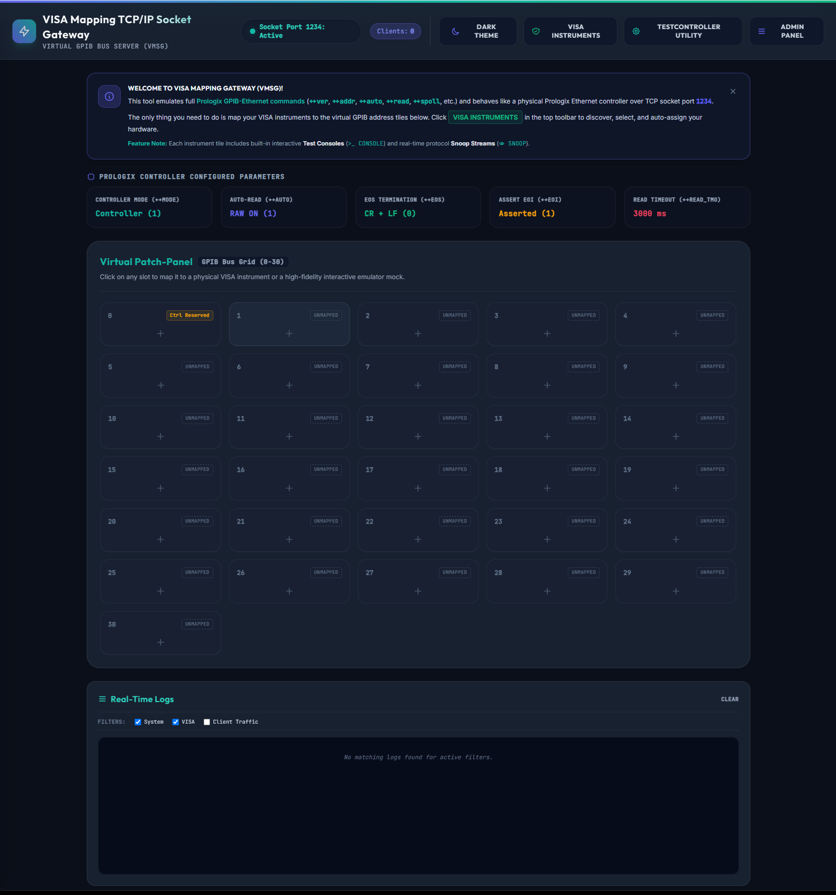
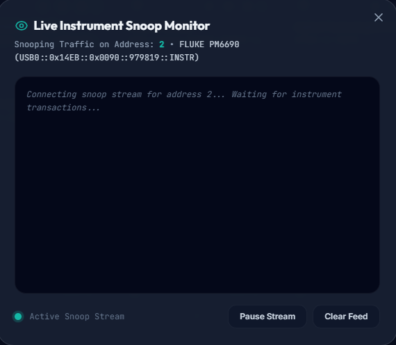

# VISA Mapping TCP/IP Socket Gateway (VMSG)

[](https://github.com/Cyclotronic/VMSG/releases)
[](https://opensource.org/licenses/MIT)


 **VISA Mapping TCP/IP Socket Gateway (VMSG)**. VMSG implements standard Prologix-style commands and control over TCP socket connections (port 1234) and bridges virtual instruments to PyVISA connections.
 Mapping your VISA connected devices on your computer to a Prologix Ethernet-style service means you can use VISA devices with tools like [TestController](https://lygte-info.dk/project/TestControllerIntro%20UK.html) that only support standard Prologix adapters.

The gateway operates concurrently on two ports:
* **Port 1234 (TCP Socket)**: Handles native, standard Prologix controller commands (`++addr`, `++auto`, `++ver`, `++read`, etc.) and routes standard SCPI command traffic to mapped physical or simulated instruments.
* **Port 8080 (FastAPI Web Server)**: Hosts a stunning, premium responsive web-based administration dashboard supporting seamless light and dark mode toggling.

---

### 🖥️ Dashboard Showcase
| Virtual Patch Panel Grid | Live Instrument SCPI Console |
| :---: | :---: |
|  |  |

| Configure Slot Mapping | Live Traffic Snoop Monitor |
| :---: | :---: |
|  |  |

---

## 📦 Pre-Compiled Standalone Binaries (Windows & Linux)

Pre-compiled, zero-dependency standalone binaries are available for official releases! You do **not** need Python installed to run them.

👉 **[Download Latest Windows & Linux Binaries](https://github.com/Cyclotronic/VMSG/releases/tag/v1.0.0)**

* **Windows**: Download `vmsg-windows-amd64.exe` and run.
* **Linux**: Download `vmsg-linux-amd64`, add execute permission (`chmod +x vmsg-linux-amd64`), and run (`./vmsg-linux-amd64`).

---

## 🛠️ Host System Prerequisites & Driver Setup

Other than the Python packages in `requirements.txt`, VMSG relies on a **VISA (Virtual Instrument Software Architecture)** library backend to talk to physical instruments. Depending on your Operating System and hardware, follow the instructions below:

### 🪟 Windows (Recommended Setup)
For the most robust hardware compatibility (especially physical GPIB cards, USB-GPIB adapters, or USBTMC instruments):
1. **Install NI Package Manager**: Download and install the [NI Package Manager](https://www.ni.com/en/support/downloads/software-products/download.ni-package-manager.html).
2. **Install NI-VISA**: Use the NI Package Manager to install **NI-VISA**. This installs the standard shared libraries (`visa32.dll` / `visa64.dll`) that Python binds to automatically.
3. **Install NI-MAX**: Install **NI-MAX (Measurement & Automation Explorer)**. This utility allows you to scan the VISA bus, assign aliases, and test communications with your physical devices to verify connection stability.
4. **Alternative Backends**: If you prefer non-NI software, you can install the [Keysight IO Libraries Suite](https://www.keysight.com/us/en/lib/software-detail/computer-software/keysight-io-libraries-suite.html) or [Rohde & Schwarz VISA](https://www.rohde-schwarz.com/us/applications/r-s-visa-application-note_56280-94848.html).

### 🐧 Linux (Ubuntu, Debian, Rocky, RedHat)
NI-VISA is officially supported on select Linux distributions (see the [NI-VISA Linux Download Page](https://www.ni.com/en/support/downloads/drivers/download.ni-visa.html#484347)). However, Linux setups can also utilize the pure-Python **`pyvisa-py`** backend included in `requirements.txt`:
* **Zero External Software for TCP & Serial**: Pure-Python `pyvisa-py` communicates directly with serial ports (`/dev/ttyUSB*` / `/dev/ttyS*`) and TCP/IP socket connections without requiring any native VISA installation.
* **USB/USBTMC Permissions (udev rules)**: If accessing USB instruments via pure Python on Linux, you must grant read/write permissions to the device nodes. Add a custom `udev` rule (e.g., in `/etc/udev/rules.d/99-usbtmc.rules`):
  ```bash
  # Example udev rule for USBTMC instruments
  SUBSYSTEMS=="usb", ACTION=="add", ATTRS{idVendor}=="XXXX", ATTRS{idProduct}=="YYYY", MODE="0666", GROUP="plugdev"
  ```
  *(Replace `XXXX` and `YYYY` with your instrument's USB Vendor and Product ID).*

---

## ⚡ Quick Start (Source / Python)

### 1. Install Dependencies
Ensure you have Python 3.9+ installed, then install the required PyVISA and server packages:
```bash
pip install -r requirements.txt
```

### 2. Start the Gateway
Run the main startup script:
```bash
./run.sh
```
*(Or manually via: `python3 vmsg.py`)*

Once started, open your web browser and navigate to:
👉 **[http://localhost:8080](http://localhost:8080)**

### 3. Run Integration Tests
With the gateway running, execute the verification suite in a separate terminal:
```bash
./run_tests.sh
```
*(Or manually via: `python3 test_emulator.py`)*

---

## 📂 Directory Structure & Modules

To help you navigate the codebase, here is what each file does:

| File | Description |
| :--- | :--- |
| 🚀 **`vmsg.py`** | **Primary Entry Point** (formerly `main.py`). Boots the unified servers, runs USB healing, and mounts both the TCP socket server and FastAPI. |
| 🖥️ **`web_app.py`** | Implements the FastAPI REST endpoints for statuses, configuration backups/restores, scans, and mapping controls. |
| 🔌 **`prologix_server.py`** | Low-latency TCP socket server (port 1234) implementing standard & extended Prologix command parsers. |
| 🎛️ **`visa_manager.py`** | Manages pyvisa sessions, resource pooling, unresponsive port cooldown caching, and simulated device mocks. |
| 📁 **`config_manager.py`** | Thread-safe manager that reads, writes, and persists virtual address mappings in `mappings.json`. |
| 📝 **`logger.py`** | Global thread-safe, in-memory circular log feed shared between socket traffic and API clients. |
| 🧪 **`test_emulator.py`** | Automated integration verification suite checking SCPI queries, timeouts, and multi-address states. |
| 🛠️ **`static/index.html`** | Single-page premium dashboard with CSS glassmorphism, responsive light/dark themes, and SCPI terminal console modals. |

---

## 🏗️ Architecture & Advanced Features

### High-Performance Resource Pooling & Healing
* **Persistent Sessions**: PyVISA connections are cached and reused globally instead of opening/closing on every byte transfer, completely eliminating connection overhead.
* **USB Lottery Healing**: Scans active physical VISA connections and checks them against target manufacturers via `*IDN?` responses. If a reboot or system event shifts device paths, the gateway auto-corrects mapping addresses in-place.
* **Unresponsive Cooldown Caching**: Ports that timeout or fail to respond are blacklisted for 120 seconds to prevent scanning routines from locking up the interface.

### High-Fidelity Device Mocks
No physical hardware? No problem. The gateway includes built-in interactive simulated instruments:
* **Mock Multimeter (`MOCK::DMM::INSTR`)**: Emulates a Hewlett-Packard 34401A, returning variable voltage/resistance measurements.
* **Mock Oscilloscope (`MOCK::SCOPE::INSTR`)**: Emulates a Tektronix TDS 2024, responding to trace queries and standard SCPI configurations.

### Custom Admin Controls
Click **ADMIN PANEL** in the top right of the dashboard to configure:
* **Unmapped Slot Behavior**: Set whether unmapped virtual channels return friendly warning messages or simulate a real physical bus timeout (`VI_ERROR_TMO`).
* **Auto-Assignment**: Scan the GPIB bus and auto-assign discovered instruments to empty virtual addresses with optional simulated-mock filtering and mapping safety guards.
* **Backup & Restore**: Export the running configuration as a JSON file and restore it instantly via drag-and-drop.

---

## 🔌 TestController Integration & Multi-Instrument Setup

Use **Export TestController Config** in the dashboard to generate `settingsGPIB.txt` and `settingsLoad.txt` from your live mappings, then drop both into TestController's `Settings` folder. The export is built so a cold start *and* a menu **Reconnect** both work:

* **One Controller ID per instrument** (`A`, `B`, `C`, …). A single shared ID trips a startup defect in TestController that stops all but one device thread.
* **`settings:++addr N` per controller.** TestController re-runs its interface init on every reconnect but does not re-send the address, so without this a Reconnect routes every device to the default slot. This field closes that gap with no changes to either program.
* **Only known driver names are emitted.** An instrument that does not map to a stock TestController driver is *excluded* and reported, never guessed — TestController abandons every remaining device when it meets a name it cannot resolve.
* **Serial scanning is off by default** (`ScanSerialPorts:0`), keeping TestController on VMSG's sockets. Turn it on and pick per-port exclusions under **Host Discovery & TestController** in the admin panel.

### Optional: A Dedicated Port Per Instrument
Off by default — everything runs on the single control port `1234`. When enabled (admin panel, the auto-assign dialog, or a per-slot field on any mapping tile), each mapped slot also listens on its own port and the export emits `settings:port:NNNN;++addr N`. A client arriving on a dedicated port is addressed to that slot automatically and never needs `++addr` at all, which makes reconnects correct regardless of client behaviour and works for a remote TestController host.

For the full technical breakdown — decompiled root causes, diagnostic logs, and the defects worth reporting upstream — see **[`TESTCONTROLLER_NOTES.md`](TESTCONTROLLER_NOTES.md)**.

